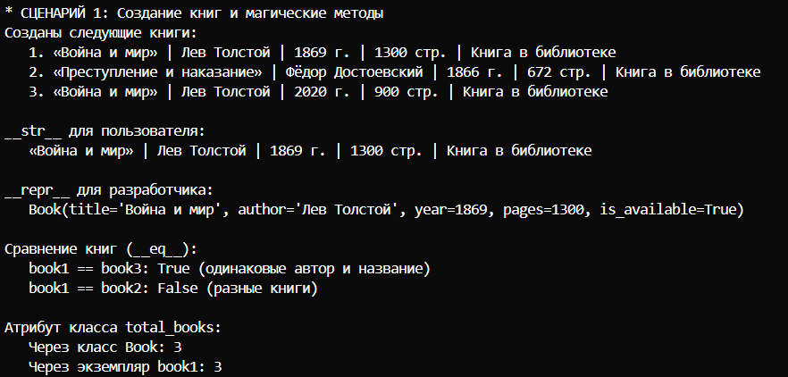
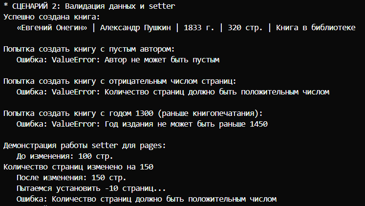
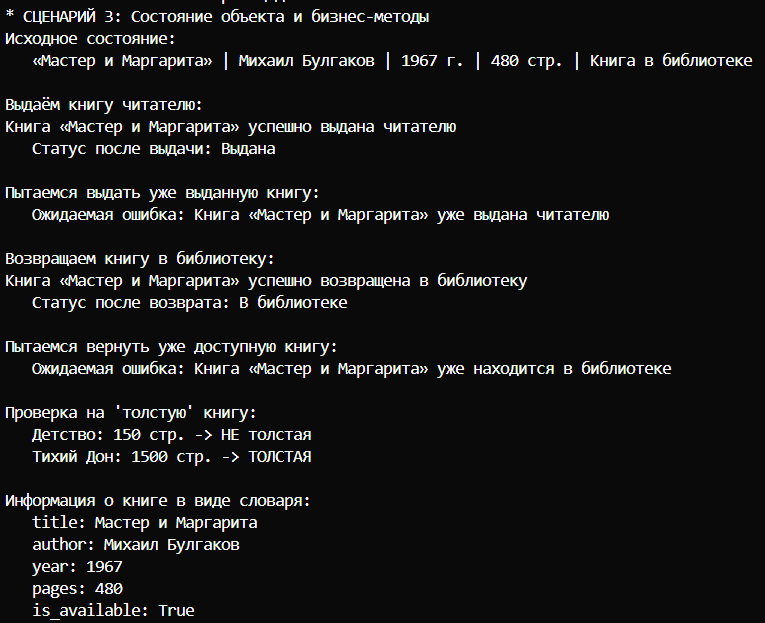
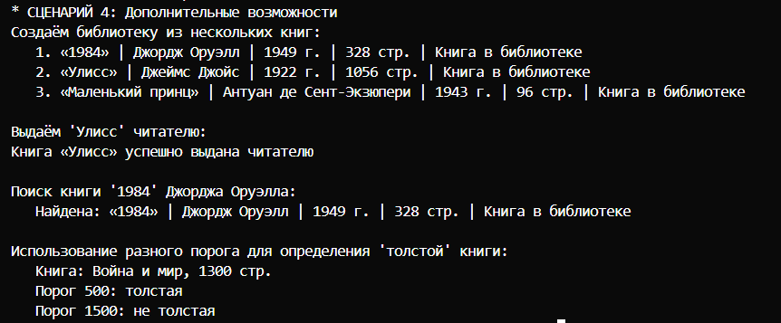

# Лабораторная работа №1: Класс и инкапсуляция

## Мыслительный процесс

### Я создал класс `Book` для библиотеки

Книга - это объект, который:
- Имеет название и автора (идентифицирующие признаки)
- Была издана в определённом году
- Имеет определённый объём (количество страниц)
- Может находиться в библиотеке или быть выданной читателю
- С ней можно выполнять действия: выдать, вернуть, оценить

### Определение атрибутов
Какая инфа нужна для описания книги в библиотеке?

Первый атрибут - название. Это строка, которая нужна, чтобы знать, что это за книга.
Второй атрибут - автор. Это строка, которая помогает отличать книги с одинаковыми названиями.
Третий атрибут - год издания. Это целое число для каталогизации и поиска.
Четвёртый атрибут - количество страниц. Это целое число для статистики и классификации.
Пятый атрибут - доступность. Это булево значение (True/False), показывающее, можно ли выдать книгу читателю.

##  Бизнес-методы

Какие действия можно делать с книгой в библиотеке?
- Выдать читателю - нужно проверить, доступна ли книга
- Принять обратно - нужно проверить, выдана ли книга
- Узнать, толстая ли книга - проанализировать количество страниц
- Изменить количество страниц - если ошиблись при вводе

## Магические методы

`__str__` - видеть понятную информацию о книге при print()

`__repr__` - видеть точное представление для отладки в консоли

`__eq__` - сравнивать книги между собой (например, при поиске)

## Валидация (в отдельном файле), проверка данных

1. Проверка названия (validate_title)
Тип данных: название должно быть строкой
Пустота: название не может быть пустой строкой или строкой из пробелов

2. Проверка автора (validate_author)
Тип данных: автор должен быть строкой
Пустота: автор не может быть пустым

3. Проверка года издания (validate_year)
Тип данных: год должен быть целым числом
Нижняя граница: год не может быть раньше 1450 (изобретение машинок для печати)
Верхняя граница: год не может быть в будущем (после 2026)

4. Проверка количества страниц (validate_pages)
Тип данных: страницы должны быть целым числом
Положительность: страниц должно быть больше 0

5. Проверка в сеттере (@pages.setter)
Использует ту же функцию validate_pages
Проверяет, что новое значение страниц тоже корректное

## Состояние объекта 
От значения _is_available зависит, можно ли выполнять операции:
Если книга выдана (_is_available = False), её нельзя выдать снова
Если книга в библиотеке (_is_available = True), её нельзя вернуть

## Ответы на вопросы

### 1. Что является сущностью?
КНИГА

### 2. Какие у него атрибуты?
Первый атрибут - название. Это строка, которая нужна, чтобы знать, что это за книга.
Второй атрибут - автор. Это строка, которая помогает отличать книги с одинаковыми названиями.
Третий атрибут - год издания. Это целое число для каталогизации и поиска.
Четвёртый атрибут - количество страниц. Это целое число для статистики и классификации.
Пятый атрибут - доступность. Это булево значение (True/False), показывающее, можно ли выдать книгу читателю.

### 3. Какие инварианты?

Инварианты - это правила, которые должны выполняться всегда:

- Название не может быть пустым
Книга без названия не может существовать в библиотеке
- Автор не может быть пустым
У любой книги есть автор 
- Год издания должен быть реалистичным
Не может быть книг, изданных до изобретения машинок для печати (1450 год) или в будущем
- Количество страниц должно быть положительным
Книга с 0 или отрицательным числом страниц - это не книга
- Книга не может быть одновременно выдана и в библиотеке
Это взаимоисключающие состояния

### 4. Что значит “равенство”?

Две книги считаются равными, если у них совпадают название и автор.

### 5. Есть ли состояние?

ДА, у книги есть два состояния:
- Доступна (_is_available = True) - книга находится в библиотеке
- Выдана (_is_available = False) - книга у читателя

От состояния зависит поведение:
- Нельзя выдать уже выданную книгу
- Нельзя вернуть книгу, которая уже в библиотеке

## Сценарии

### 1. Создание книг и магические методы.

### 2. Валидация данных и setter

### 3. Состояние объекта и бизнес-методы

### 4. Дополнительные возможности
