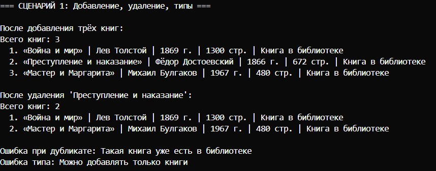
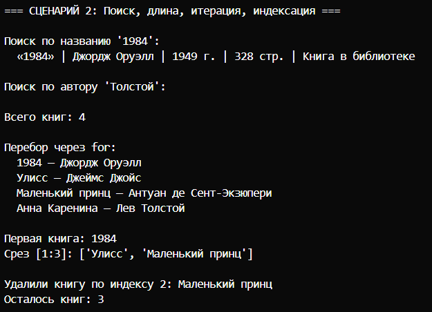
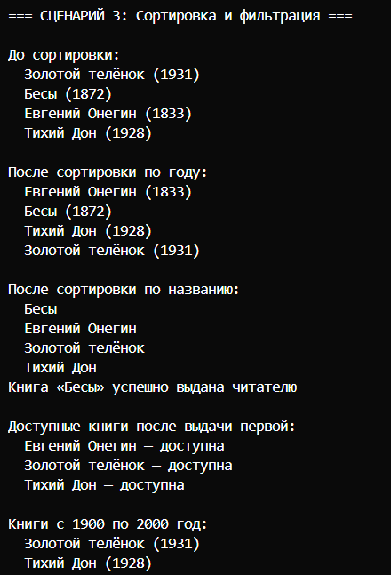

# Лабораторная работа №2

## Цель
Работаем с коллекциями объектов: храним группу книг, добавляем, удаляем, ищем, сортируем, фильтруем. 

## Что получилось

Использовал класс `Book` из первой лабы. Сделал класс (коллекцию) `Library`, который внутри хранит список книг (`self._books`).

### Основные методы

- `add(book)` - добавить книгу. Проверяет тип (только `Book` и его наследников) и не даёт добавить дубликат (через `__eq__` по названию и автору).
- `remove(book)` - удалить книгу по ссылке на объект.
- `remove_at(index)` - удалить книгу по индексу, возвращает удалённую книгу.
- `get_all()` - вернуть копию списка всех книг.
- `find_by_name(name)` - ищет книгу по точному совпадению названия (без учёта регистра). Возвращает первую найденную или `None`.
- `find_by_writer(writer)` - возвращает список всех книг указанного автора.

### Магические методы

- `__len__` - чтобы можно было писать `len(library)`.
- `__iter__` - чтобы можно было перебирать книги через `for book in library`.
- `__getitem__` - чтобы работали индексы и срезы: `library[0]`, `library[1:3]`.

### Сортировка и фильтрация

- `sort(key, reverse)` - сортирует саму коллекцию по одному из полей: `'name'`, `'writer'`, `'year'`, `'pages'`. 
- `filter_available()` - возвращает новую коллекцию, содержащую только доступные книги.
- `filter_by_year(year_from, year_to)` - возвращает новую коллекцию с книгами, год которых попадает в диапазон.

**Сценарий 1 - базовая работа**
Создаю библиотеку, добавляю несколько книг, вывожу. Удаляю одну книгу, вывожу снова. Если добавить дубликат - ошибка. Если добавить не книгу - тоже ошибка.

**Сценарий 2 - поиск, длина, итерация, индексация**
Добавляю книги. Ищу по названию (`find_by_name`), по автору (`find_by_writer`). Вывожу количество книг через `len()`. Прохожу циклом `for`. Беру книгу по индексу `[0]`, беру срез `[1:3]`. Удаляю книгу по индексу и смотрю сколько книг

**Сценарий 3 - сортировка и фильтрация**
Добавляю несколько книг. Сортирую по году, потом по названию. Выдаю одну книгу, затем фильтрую доступные книги и вывожу их. Фильтрую книги по диапазону годов (1900–2000) и вывожу.

