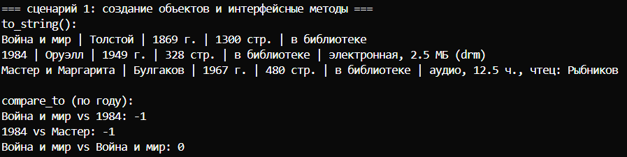
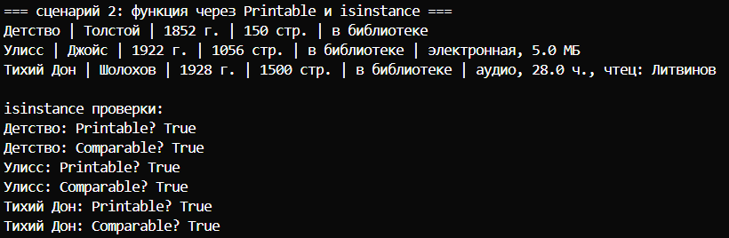
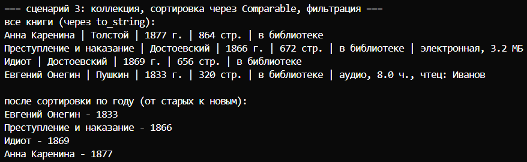

# Лабораторная работа №4

## Цель
Познакомиться с абстрактными классами и интерфейсами (ABC). Научиться задавать обязательные методы через `@abstractmethod`, использовать полиморфизм через единый контракт.

## Что получилось

Создал два интерфейса в файле `interfaces.py`:

- **Printable** — требует метод `to_string()`, который возвращает строковое описание объекта.
- **Comparable** — требует метод `compare_to(other)`, возвращающий -1, 0 или 1 (сравниваю книги по году издания).

### Реализация в классах
Классы `Book`, `Ebook`, `AudioBook` из прошлых работ теперь реализуют оба интерфейса.

- `to_string()`: у обычной книги выводит основные поля, у `Ebook` добавляет размер файла и DRM, у `AudioBook` - длительность и чтеца.
- `compare_to()` одинаков для всех (сравнение по году), определён в `Book` и наследуется.

**Сценарий 1 — создание объектов и вызов интерфейсных методов**
Создаю книги трёх типов, вызываю `to_string()` - вывод различается. Сравниваю через `compare_to()` — старые книги считаются «меньше».

**Сценарий 2 — функция через интерфейс Printable и isinstance**
Написал функцию `print_all(things)`, которая принимает любые объекты с методом `to_string()` и печатает их. Проверяю `isinstance` - все книги действительно реализуют оба интерфейса.

**Сценарий 3 — коллекция, сортировка через Comparable, фильтрация**
Добавляю книги в `Library`. Вывожу все через `to_string()`. Сортирую самодельной сортировкой пузырьком, использующей `compare_to()` - получаю книги по году от старых к новым. Метод `get_printable()` фильтрует коллекцию по интерфейсу `Printable` (возвращает все книги, т.к. все его реализуют).
