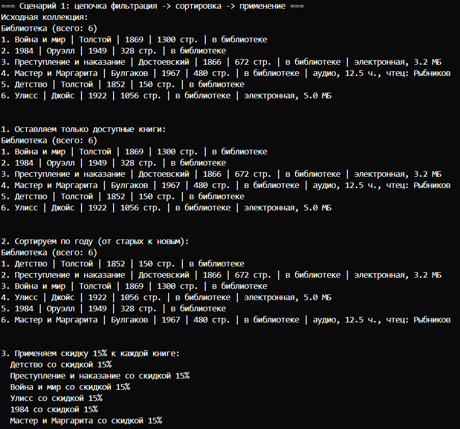
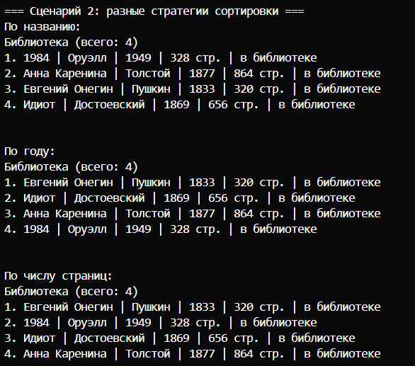
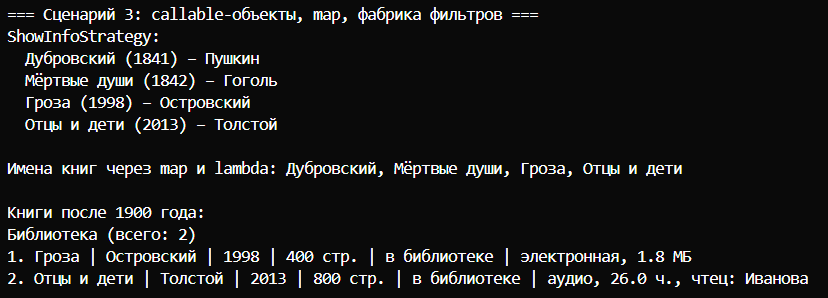

# Лабораторная работа №5

## Цель
Научиться передавать функции как аргументы, использовать `map`, `filter`, `lambda`, реализовать паттерн «Стратегия» и строить цепочки операций над коллекцией

## Что получилось

### Файл `strategies.py`
- **Стратегии сортировки**: `by_name`, `by_year`, `by_pages`, `by_author`, `by_name_then_year`.
- **Функции-фильтры**: `is_available`, `is_thick`, `make_year_filter` (фабрика, возвращает фильтр по диапазону лет).
- **Callable-объекты** (паттерн «Стратегия»): `DiscountStrategy`, `ShowInfoStrategy`.

### Класс `AdvancedLibrary` (наследник `Library` из ЛР2)
Добавлены методы:
- `sort_by(key_func)` - сортировка по переданной функции ключа.
- `filter_by(predicate)` - возвращает новую коллекцию, отфильтрованную по условию.
- `apply(func)` - применяет функцию к каждому элементу, возвращает список результатов.

Всё работает с книгами (`Book`, `Ebook`, `AudioBook`).

**Сценарий 1 - цепочка операций**
Создаю коллекцию книг.  
1. Фильтрую `filter_by(is_available)` - оставляю только те, что в библиотеке.  
2. Сортирую `sort_by(by_year)` - от старых к новым.  
3. Применяю `apply(DiscountStrategy(15))` - к каждой книге применяется стратегия скидки. Просто вывод   
Вывожу рез каждого шага

**Сценарий 2 — замена стратегий сортировки**
Одну и ту же коллекцию сортирую разными ключами: по названию, году, страницам, автору. Функция `sort_by` не меняется, я просто подставляю другую стратегию.

**Сценарий 3 — callable-объекты, map, фабрика фильтров**
- Использую `ShowInfoStrategy()` как callable-объект, чтобы превратить книгу в строку.  
- Применяю `map` с лямбдой для получения списка имён книг.  
- Фабрика `make_year_filter(1900)` создаёт фильтр для книг после 1900 года.  
- Отфильтровываю и вывожу.
