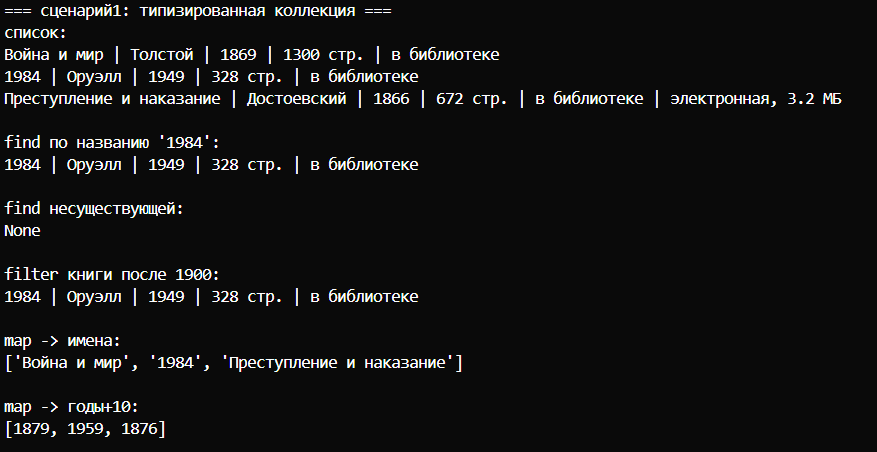
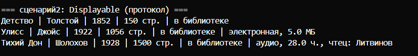
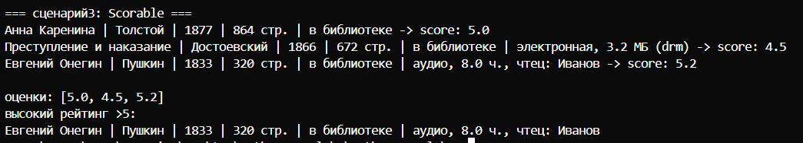

# Лабораторная работа №6

## Цель
Разобраться с аннотациями типов, научиться делать обобщённые классы (дженерики) через `TypeVar` и `Generic`, освоить структурную типизацию через `Protocol`.

### Файл `models.py`
- Классы `Book`, `Ebook`, `AudioBook` из прошлых лаб **полностью аннотированы**:
  - параметры конструктора: `name: str`, `year: int` и т.д.
  - возвращаемые значения методов: `-> str`, `-> None`, `-> float`
  - атрибуты экземпляра: `self._name: str`
- Добавлены методы `display() -> str` и `score() -> float` (для протоколов).

### Файл `container.py`
- **Протоколы** (структурные интерфейсы):
  - `Displayable` требует метод `display() -> str`
  - `Scorable` требует метод `score() -> float`
- **Типовые переменные**:
  - `T` - для обычной коллекции
  - `R` - для результата `map` (может отличаться от `T`)
  - `D = TypeVar('D', bound=Displayable)` - только объекты с `display()`
  - `S = TypeVar('S', bound=Scorable)` - только объекты с `score()`
- **Обобщённая коллекция `TypedCollection[T]`**:
  - хранит `_items: list[T]`
  - методы: `add`, `remove`, `get_all`
  - **`find(predicate: Callable[[T], bool]) -> Optional[T]`**
  - **`filter(predicate: Callable[[T], bool]) -> list[T]`**
  - **`map(transform: Callable[[T], R]) -> list[R]`** (тип результата может меняться)

**Сценарий 1 - базовая типизированная коллекция**
Создаю `TypedCollection[Book]`, добавляю книги. Показываю `find` (поиск по названию), `filter` (книги после 1900 года), `map` (имена книг, годы+10). Всё типобезопасно.

**Сценарий 2 - коллекция с протоколом Displayable**
`TypedCollection[Displayable]` - объекты `Book`, `Ebook`, `AudioBook` подходят под протокол (у всех есть `display()`), хотя явно от `Displayable` не наследуются. Вывожу каждый через `display()`.

**Сценарий 3 - коллекция с протоколом Scorable**
`TypedCollection[Scorable]` - у всех книг есть метод `score()`. Вывожу оценки через `map`, фильтрую книги с рейтингом >5. Типовые ограничения проверяются статически.
